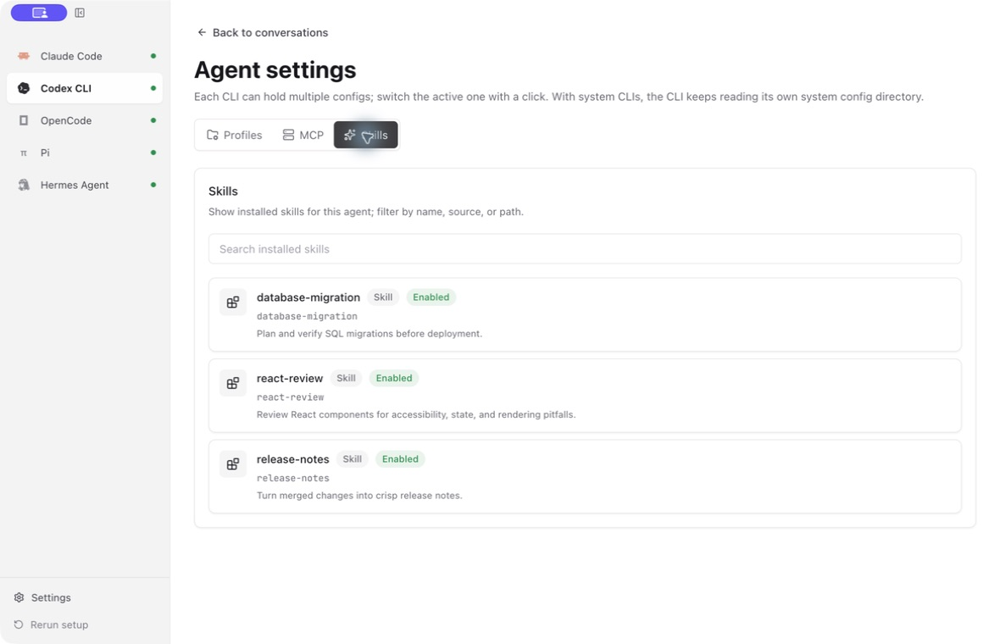
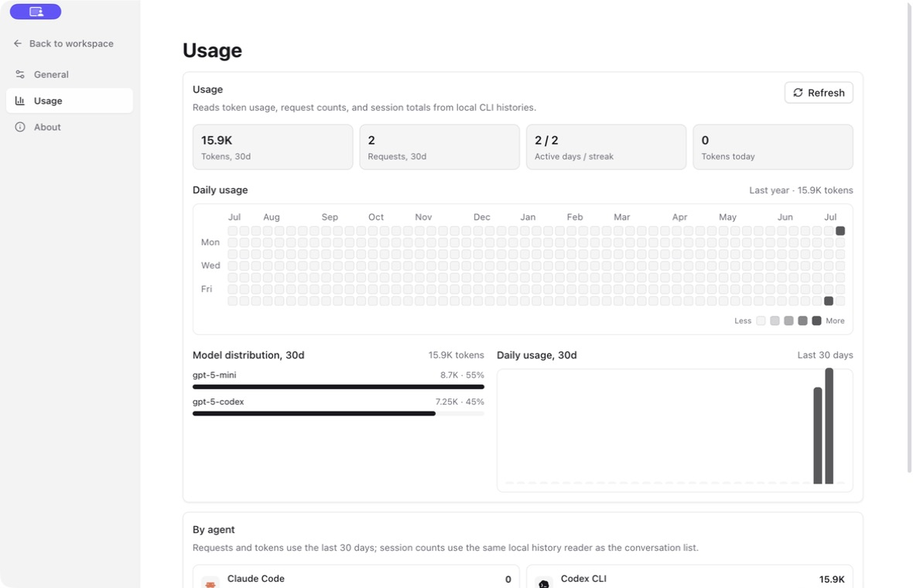

<div align="center">
  
  <h1>Agent Launcher</h1>
  <p>Configure and run your existing coding-agent CLIs from one desktop app.</p>
  <p>
    <a href="https://github.com/matrixlabs/agent-launcher/actions/workflows/ci.yml"></a>
    <a href="https://github.com/matrixlabs/agent-launcher/releases"></a>
    <a href="./LICENSE"></a>
  </p>
</div>

Agent Launcher is a local desktop workspace for coding-agent CLIs. It links CLIs already installed on your system and handles account and provider configuration, native config files, sessions, usage, MCP servers, Skills, and terminals through a graphical interface. CLI installation and upgrades remain under your control through each project's official process.


## Contents

- [Supported Agents](#supported-agents)
- [Install](#install)
- [Features](#features)
- [How Agent Launcher Works](#how-agent-launcher-works)
- [Platforms](#platforms)
- [Privacy and Security](#privacy-and-security)
- [Development](#development)
- [Project](#project)

## Supported Agents

| Agent | CLI source | Configuration and runtime |
| --- | --- | --- |
| [Claude Code](https://www.anthropic.com/claude-code) | Existing system installation | Official account or Anthropic-compatible API profiles |
| [Codex CLI](https://github.com/openai/codex) | Existing system installation | ChatGPT account or OpenAI-compatible API profiles |
| [OpenCode](https://opencode.ai/) | Existing system installation | OpenAI-compatible providers |
| [Pi](https://github.com/badlogic/pi-mono) | Existing system installation | OpenAI-compatible providers |
| [Hermes Agent](https://github.com/NousResearch/hermes-agent) | Existing system installation | Existing account or OpenAI-compatible providers |

## Install

Download the appropriate package from [GitHub Releases](https://github.com/matrixlabs/agent-launcher/releases).

- macOS: DMG and ZIP
- Windows: NSIS installer
- Linux: AppImage

On first launch, Agent Launcher detects existing CLIs and links the selected system commands. Missing CLIs must be installed separately by following each project's official documentation.

## Features

### Guided setup and CLI linking

The first-run wizard checks the local environment, detects and links existing agent binaries, and walks through account or API configuration. Missing CLIs link to their official installation documentation. Claude Code and Codex CLI can use official login flows; supported agents can also use provider presets or custom compatible endpoints.

Agent Launcher does not download, install, reinstall, or update agent CLIs. Existing legacy managed installations remain readable for compatibility, while newly linked CLIs continue using their normal system-managed config homes and history.

### Workspace, terminal, chat, and sessions

The main workspace shows every configured agent in one sidebar, with local session history for the selected CLI. You can start a fresh session, resume a saved conversation, delete local session records, open the agent in an external terminal, or use an in-app chat workflow where supported.

Agent Launcher reads the CLIs' own local history formats instead of uploading conversation data. It understands Claude Code, Codex CLI, and Pi JSONL histories, plus OpenCode's SQLite-backed storage. Workspace tabs let multiple terminals, chats, and transcripts stay open at once, with keyboard tab navigation.

### Profiles and native config sync


Each agent can keep multiple profiles. A profile can represent an official account, a preset relay, or a custom OpenAI/Anthropic-compatible endpoint with its own base URL, API key, and model.

When the active profile changes, Agent Launcher synchronizes both runtime environment variables and native config files expected by the underlying CLI. Native config previews are shown in the UI with secrets masked, so you can verify what will be written without exposing full keys on screen.

Supported native config targets include Claude Code settings, Codex `config.toml` and `auth.json`, OpenCode `opencode.json`, Pi `models.json` and settings, and Hermes Agent config/env files.

### MCP servers


Agent Launcher reads MCP server entries from each agent's native configuration and shows transport type, command or URL, enabled state, and source file. Codex plugin-bundled MCP servers are shown as read-only entries so you can inspect them without accidentally editing plugin-managed resources.

Supported MCP config styles include Codex TOML, Claude-style JSON `mcpServers`, OpenCode JSON MCP entries, and Hermes YAML configuration.

### Skills



Installed Skills are displayed from the selected agent's managed skill roots. You can filter by name, source, or path, and open a Skill to inspect its `SKILL.md` content from inside the app. Agent Launcher can also search and install Skills from [skills.sh](https://skills.sh/) for supported agents.

### Usage dashboard



The Usage tab summarizes local agent activity across token totals, request counts, active days, session counts, model distribution, daily usage, and per-agent breakdowns. Optional local model-pricing records can be used to organize cost information without sending usage data to another service.

### Permission and update controls

CLI-specific permission bypass settings are exposed only when the underlying agent supports them. For example, Codex and Claude Code have different auto-approve flags, and Pi does not expose one.

The Settings area can compare installed CLI versions with current releases and check GitHub Releases for Agent Launcher updates. CLI upgrades are performed outside the app.

### Themes and localization

Agent Launcher supports light, dark, and system themes. The app UI is localized in Chinese and English, while open-source docs and package metadata are English-first.

## How Agent Launcher Works

Agent Launcher is an Electron app with a React renderer and a TypeScript main process. The renderer talks to the main process only through the typed preload bridge. The main process owns filesystem access, CLI detection and linking, config writing, PTY sessions, usage scans, and update checks.

Agent configuration is applied in two layers:

- Environment variables apply the selected provider endpoint when a CLI is launched. Legacy managed installations may still use redirected config directories.
- Native config files are written for CLIs that require file-based configuration in addition to, or instead of, environment variables.

This keeps the visible UI simple while still matching each CLI's real runtime expectations.

## Platforms

Release builds are available for macOS, Windows, and Linux. The installer formats are DMG/ZIP for macOS, NSIS for Windows, and AppImage for Linux.

## Privacy and Security

Agent Launcher is local-first, but not offline-only. CLI version checks may contact npm or PyPI, Agent Launcher updates may contact GitHub Releases, and Skills features may contact skills.sh. Running an agent sends requests to the official provider or relay endpoint selected in that agent's active profile.

API keys are deliberately stored as plaintext in `~/.agent-launcher/config.json` and, when required, in sandboxed CLI-native config files. Secrets are masked in the interface, but the files remain readable by your local user account. Never attach real config directories, unredacted logs, or screenshots containing credentials to a public issue.

Session history and usage data are read from local CLI files. Agent Launcher does not upload those histories to a separate analytics service.

Please report vulnerabilities according to the [security policy](./SECURITY.md).

## Development

Requirements:

- Node.js 22 or newer
- pnpm, matching the `packageManager` field in `package.json`

Common commands:

```bash
pnpm dev
pnpm typecheck
pnpm test:run
pnpm verify
pnpm build
pnpm package
```

Use `pnpm verify` as the normal correctness gate after code edits, or `pnpm typecheck` for a quicker pass. CI also runs `pnpm audit:ci`, which fails on high-severity dependency advisories. See the [contributing guide](./CONTRIBUTING.md) for architecture, testing, packaging, and release details.

## Project

- [Contributing guide](./CONTRIBUTING.md) - local setup, development commands, architecture, testing, and release details
- [Security policy](./SECURITY.md) - supported versions and private vulnerability reporting
- [Issue tracker](https://github.com/matrixlabs/agent-launcher/issues) - bug reports and feature requests

## License

Agent Launcher is released under the [MIT License](./LICENSE).
