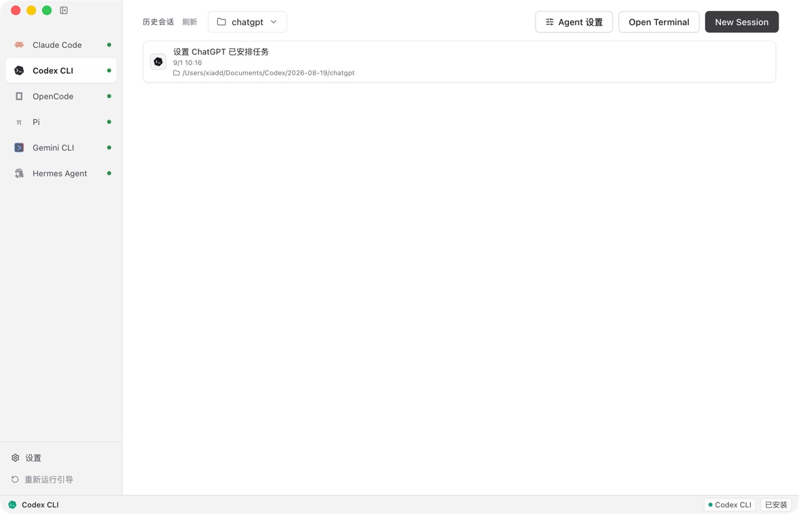
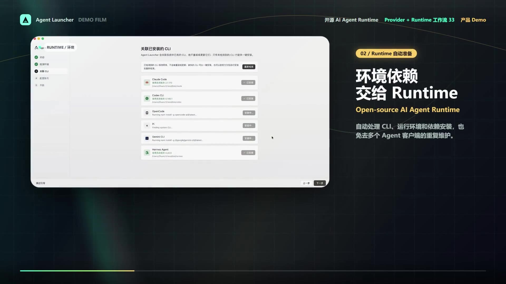
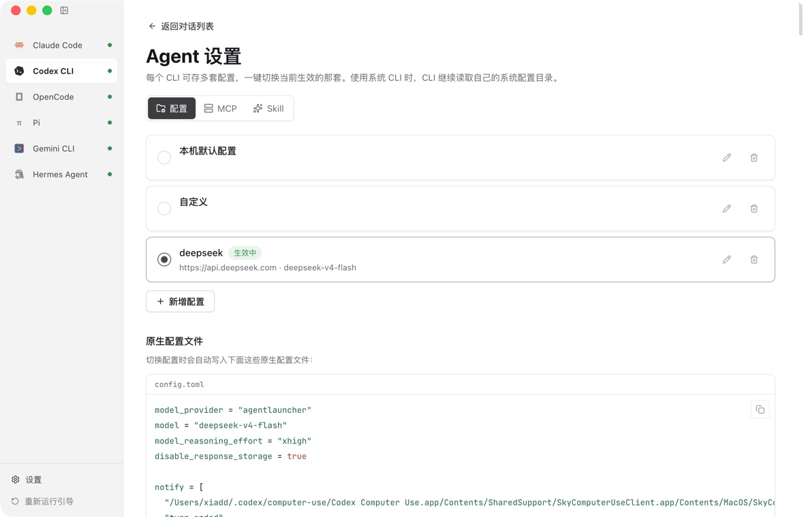
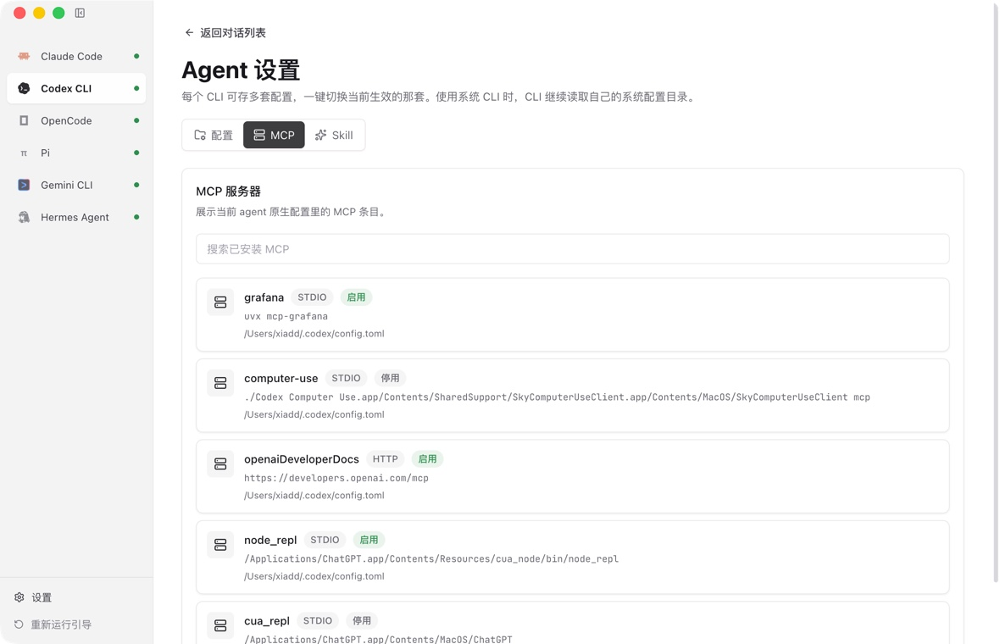

<div align="center">
  
  <h1>Agent Launcher</h1>
  <p>Configure and run existing coding-agent CLIs from one desktop app.</p>
  <p><strong>English</strong> | <a href="./README_ZH.md">中文</a></p>
  <p>
    <a href="https://github.com/WhiteMatrixTech/agent-launcher/actions/workflows/ci.yml"></a>
    <a href="https://github.com/WhiteMatrixTech/agent-launcher/releases"></a>
    <a href="./LICENSE"></a>
  </p>
</div>

Agent Launcher is a local desktop workspace for coding-agent CLIs. It detects and links CLIs already installed on your system, installs the ones you don't have in one click, applies account or provider configuration, and runs each agent in an embedded terminal or chat view. A CLI you already have is never reinstalled or updated.



## Product Demo

[](https://cdn.jsdelivr.net/gh/agent-launch/agent-launcher@main/docs/videos/agent-launcher-demo.mp4)

[Watch the 40-second product demo](https://cdn.jsdelivr.net/gh/agent-launch/agent-launcher@main/docs/videos/agent-launcher-demo.mp4)

## Supported Agents

| Agent                                                        | CLI source                   | Configuration and runtime                             |
| ------------------------------------------------------------ | ---------------------------- | ----------------------------------------------------- |
| [Claude Code](https://www.anthropic.com/claude-code)         | Existing system installation | Official account or Anthropic-compatible API profiles |
| [Codex CLI](https://github.com/openai/codex)                 | Existing system installation | ChatGPT account or OpenAI-compatible API profiles     |
| [OpenCode](https://opencode.ai/)                             | Existing system installation | OpenAI-compatible providers                           |
| [Pi](https://github.com/badlogic/pi-mono)                    | Existing system installation | OpenAI-compatible providers                           |
| [Gemini CLI](https://github.com/google-gemini/gemini-cli)    | Existing system installation | Google API key or compatible provider                 |
| [Hermes Agent](https://github.com/NousResearch/hermes-agent) | Existing system installation | Existing account or OpenAI-compatible providers       |

## Install

Download the appropriate package from [GitHub Releases](https://github.com/WhiteMatrixTech/agent-launcher/releases).

- macOS: DMG and ZIP for Intel and Apple silicon
- Windows: NSIS installer
- Linux: AppImage

On first launch, Agent Launcher detects existing CLI commands and lets you select the command to link when multiple copies are present. A CLI that is not found can be installed in one click, or you can install it yourself from the project's official documentation and detect it again.

## Features

### Guided setup and CLI linking

The first-run wizard checks the local environment, links existing agent binaries, and walks through official-account or API configuration. A CLI it cannot find can be installed in one click: Claude Code uses its official installer and falls back to npm when that host is unreachable, the other npm-published CLIs install with your own npm (and therefore your own registry or mirror), and Hermes Agent uses its official installer. Legacy app-managed installations remain readable so existing users can migrate without losing configuration.

### Project-aware sessions

Choose or drag in a project folder before starting a session. Agent Launcher remembers the most recent folder and launches the selected CLI with that directory as its working directory. Saved sessions resume in the working directory recorded by the CLI.

### Profiles and connectivity checks



Each agent can keep multiple provider profiles. When a profile changes, Agent Launcher synchronizes the environment variables and native config files expected by that CLI. A real minimal model request checks the endpoint, credentials, model, network, and account status before the profile is used.

Native config previews mask secrets in the UI. Supported targets include Claude Code settings, Codex `config.toml` and `auth.json`, OpenCode `opencode.json`, Pi models and settings, and Hermes Agent config/env files. Gemini CLI is configured through environment variables only, which appear in the environment preview instead.

### Sessions, MCP, Skills, and usage

Agent Launcher reads each CLI's own local conversation history. It supports the JSONL and SQLite layouts used by the supported agents, and can resume or delete the underlying local session record.



Installed MCP servers and Skills can be inspected from the app. Agent Launcher does not install Skills from a remote catalog. The usage dashboard summarizes locally stored token counts, request counts, sessions, models, and optional local pricing data.

## Privacy and Security

Agent Launcher is local-first, not offline-only. Running an agent sends requests to the official provider or relay selected in its active profile. Version checks may contact npm, PyPI, or GitHub.

API keys are deliberately stored as plaintext in `~/.agent-launcher/config.json` and, when required, in CLI-native config files. Secrets are masked in the interface, but remain readable by your local user account. Session history and usage data are read locally and are not uploaded to a separate analytics service.

Report vulnerabilities according to the [security policy](./SECURITY.md).

## FAQ

<details>
<summary>Where is data stored?</summary>

Agent Launcher state is stored under `~/.agent-launcher/`, including plaintext provider keys in `config.json`. System-linked CLIs continue using their normal config and history directories. Legacy app-managed CLI directories remain readable for compatibility.

</details>

<details>
<summary>Why does Agent Launcher link CLIs instead of installing them?</summary>

CLI ownership stays with the user and the CLI's official installer or package manager. This avoids silently replacing commands, changing global npm state, or redirecting a system CLI into an app-specific config home.

</details>

<details>
<summary>Why does the operating system warn about a downloaded build?</summary>

Release automation signs and verifies artifacts when the repository's signing secrets are configured. Without a Windows certificate, the workflow deliberately publishes an unsigned build and Windows SmartScreen may show an unknown-publisher warning. Without Apple signing and notarization credentials, macOS builds are also explicitly unsigned. Linux AppImage users may need FUSE 2 or may extract the AppImage on distributions that do not ship it.

</details>

<details>
<summary>Which environment overrides are available?</summary>

`AGENT_LAUNCHER_UPDATE_OWNER`, `AGENT_LAUNCHER_UPDATE_REPO`, and `AGENT_LAUNCHER_UPDATE_POLICY_URL` redirect update checks for downstream builds. Standard CLI variables such as `CODEX_HOME`, `GEMINI_CLI_HOME`, `HERMES_HOME`, and XDG data/config variables pass through to the launched CLI; config-file sync honors `HERMES_HOME`, `GEMINI_CLI_HOME`, and `XDG_CONFIG_HOME`, but always writes Codex files to `~/.codex` even when `CODEX_HOME` is set. Active API profiles intentionally override provider credentials for the launched process.

</details>

## Development

Requirements are Node.js 22 or newer and the pnpm version declared in `package.json`.

```bash
pnpm install
pnpm dev
pnpm verify
pnpm lint
pnpm format:check
pnpm build
```

See [CONTRIBUTING.md](./CONTRIBUTING.md) for architecture, code rules, tests, commits, and pull requests. See [SUPPORT.md](./SUPPORT.md) for usage questions and bug-reporting guidance.

## Project

- [Changelog](./CHANGELOG.md)
- [Code of Conduct](./CODE_OF_CONDUCT.md)
- [Security policy](./SECURITY.md)
- [Discussions](https://github.com/WhiteMatrixTech/agent-launcher/discussions)
- [Issue tracker](https://github.com/WhiteMatrixTech/agent-launcher/issues)

## License

Agent Launcher is released under the [MIT License](./LICENSE).
